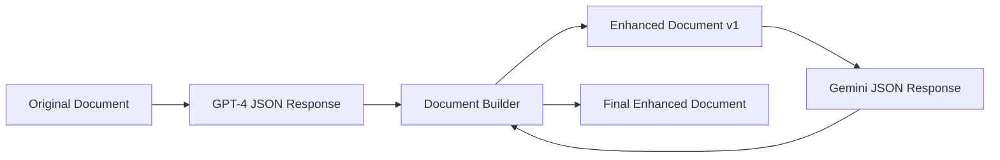

# Document Builder for JSON-Enhanced Multi-Agent Process

## Overview

This document describes how to integrate JSON-formatted AI enhancements into our mcp-devkit documents while preserving formatting and structure.

## Process Flow



## JSON Integration Rules

### 1. Section Enhancement
- Use `section` field to target specific document sections
- Support dot notation: `"Core Requirements > Must Have"`
- Actions: `add`, `modify`, `enhance`, `replace`

### 2. Content Preservation
- Always preserve emoji headers (📋, 👥, 🎯)
- Maintain checkbox formatting `- [ ]`
- Keep markdown structure (>, **, etc.)
- Preserve multi-agent tracking sections

### 3. Integration Priority
```
1. Original document structure (HIGHEST)
2. New sections (if rationale is strong)
3. Content enhancements
4. Metric updates
5. Risk additions
```

## Document Builder Logic

### Step 1: Parse JSON Response
```json
{
  "agent": "gpt4",
  "round": 2,
  "enhancements": [...],
  "new_sections": [...],
  "metrics_updates": [...],
  "risks_identified": [...]
}
```

### Step 2: Apply Enhancements
For each enhancement:
1. Locate target section
2. Apply action (`add`/`modify`/`enhance`/`replace`)
3. Preserve surrounding formatting
4. Add rationale to refinement notes

### Step 3: Add New Sections
1. Find insertion location
2. Maintain heading hierarchy
3. Add emoji if section type matches pattern
4. Update table of contents if needed

### Step 4: Update Multi-Agent Notes
Add to refinement tracking:
```markdown
### GPT-4 Enhancement (Round 2)
**Enhancements Made**: [from summary.key_improvements]
**Technical Additions**: [from summary.technical_additions]
**Areas for Next Agent**: [from summary.concerns_for_next_agent]
```

## Example Integration

### Original Section:
```markdown
### Must Have (P0)
- [ ] **Complete Template Library**: All essential templates
- [ ] **Multi-Agent Workflow**: Functional 3-agent refinement process
```

### JSON Enhancement:
```json
{
  "section": "Core Requirements > Must Have",
  "action": "add", 
  "location": "after existing items",
  "content": "- [ ] **Template Validator**: CLI + GitHub Action",
  "rationale": "Need automated validation"
}
```

### Result:
```markdown
### Must Have (P0)
- [ ] **Complete Template Library**: All essential templates
- [ ] **Multi-Agent Workflow**: Functional 3-agent refinement process
- [ ] **Template Validator**: CLI + GitHub Action
```

## Quality Assurance Checklist

After integration:
- [ ] All emoji headers preserved
- [ ] All checkboxes intact `- [ ]`
- [ ] Markdown quotes preserved `>`
- [ ] Multi-agent notes updated
- [ ] New content follows existing patterns
- [ ] No formatting corruption
- [ ] Document validates against schema

## Error Handling

If JSON enhancement conflicts with structure:
1. Log the conflict
2. Apply best-effort integration
3. Note in refinement tracking
4. Flag for manual review

## Benefits of JSON Approach

✅ **Precise Control**: Exact placement of enhancements  
✅ **Format Preservation**: No accidental formatting loss  
✅ **Audit Trail**: Clear rationale for each change  
✅ **Quality Control**: Structured validation possible  
✅ **Automation Ready**: Can build CLI tools later  

## Implementation Status

- [x] JSON schema defined
- [x] GPT-4 prompt updated for JSON output
- [x] Gemini prompt updated for JSON output  
- [ ] Document builder implementation
- [ ] Integration testing with real JSON responses
- [ ] Quality validation automation

This approach gives us the benefits of multi-agent enhancement while maintaining complete control over document structure and formatting.