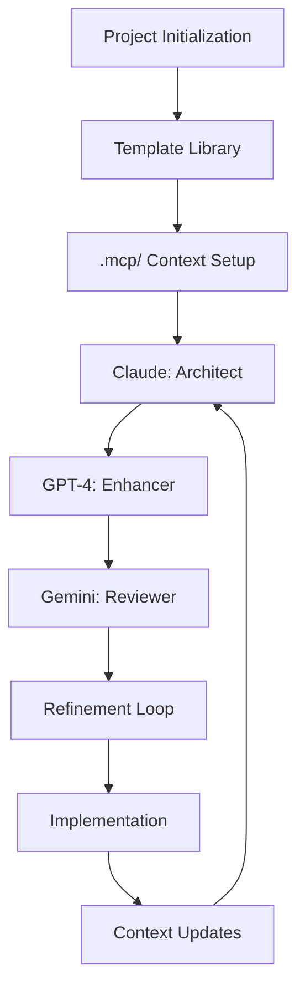
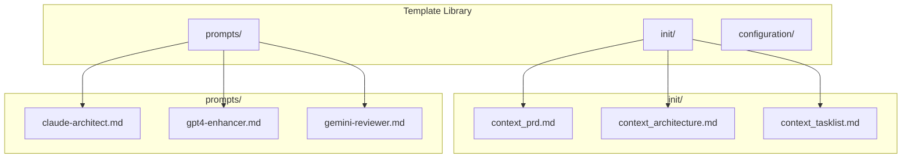
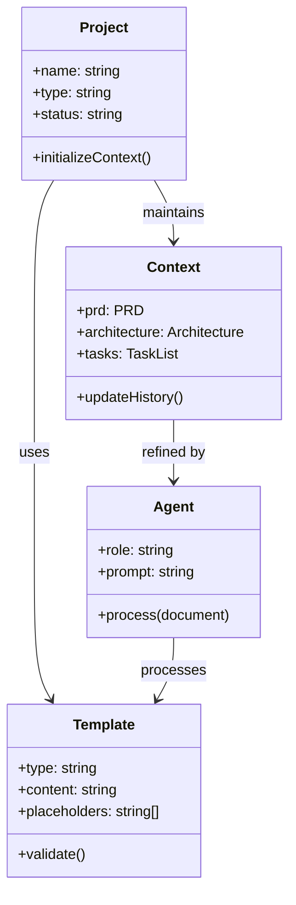
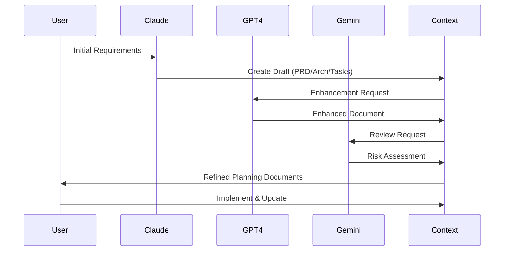
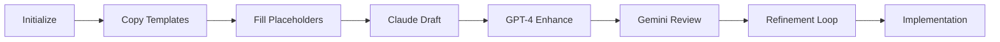
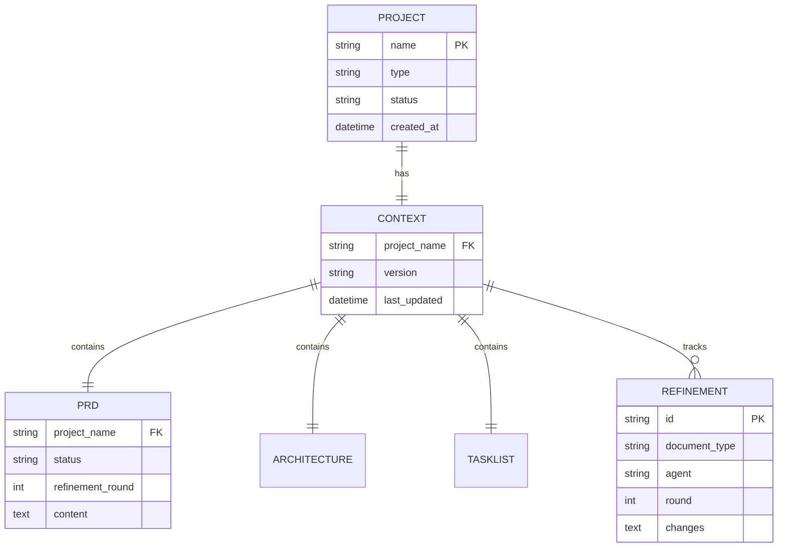
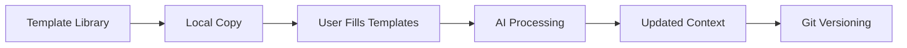
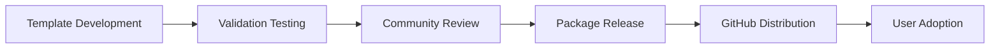

# mcp-devkit Methodology Architecture Document

> **Status**: Draft  
> **Last Updated**: 2024-07-XX  
> **Version**: 1.0  
> **Refinement Round**: 1 of 3

## 🏗️ Architecture Overview

### Methodology Vision
mcp-devkit is designed as Claude's **persistent development partner** - an MCP server that provides structured project management, multi-agent orchestration, and development state persistence. It prevents Claude from drifting by maintaining project context and providing systematic development guidance across sessions.

### Core Principles
- **Template-Driven**: All interactions follow predefined templates to ensure consistency and completeness
- **Multi-Agent Orchestration**: Systematic refinement through specialized AI agents (Claude → GPT-4 → Gemini)
- **Context Persistence**: Maintain project state across sessions through .mcp/ directory structure
- **Tool Integration**: Native compatibility with Claude Code, RepoPrompt, and Serena ecosystems

## 🎯 Architecture Goals

### Primary Goals
- [ ] **Standardized Development Process**: Provide consistent, repeatable methodology for AI-assisted development
- [ ] **Multi-Agent Orchestration**: Enable systematic refinement through specialized AI agent collaboration
- [ ] **Persistent Context Management**: Maintain project intelligence across development sessions
- [ ] **Seamless Tool Integration**: Native compatibility with existing developer workflows and tools

### Quality Attributes
- **Scalability**: Support projects from solo MVPs to enterprise applications with 100+ developers
- **Performance**: Template initialization <2min, multi-agent cycles <60min, instant context loading
- **Security**: No sensitive data in templates, git-friendly formats, user-controlled AI access
- **Maintainability**: Self-documenting templates, version-controlled methodology, community-driven evolution

## 🏛️ Methodology Architecture

### High-Level Methodology Flow



### Component Overview

| Component | Responsibility | Implementation |
|-----------|---------------|----------------|
| **Template Library** | Provide standardized planning documents | Markdown templates with placeholders |
| **Context Management** | Persistent project state across sessions | .mcp/ directory with versioned files |
| **Multi-Agent Prompts** | Guide AI agent specialization | Structured prompt templates |
| **Integration Layer** | Connect with development tools | Documentation and examples |
| **Validation System** | Ensure template completeness | Automated checks and guidelines |
| **Community Hub** | Enable template sharing and evolution | GitHub-based contribution model |

## 📦 Template Architecture

### Template Library Structure



### Methodology Domain Model



## 🔄 Workflow Architecture

### Multi-Agent Refinement Flow



### Template Processing Pipeline



## 🗄️ Context Architecture

### Project Context Structure

#### Context Relationship Diagram



#### Context Data Models

```typescript
// Core context interfaces
interface ProjectContext {
  name: string;
  type: 'web-app' | 'mobile-app' | 'api' | 'library';
  status: 'planning' | 'development' | 'deployed';
  createdAt: Date;
  lastUpdated: Date;
}

interface TemplateMetadata {
  type: 'prd' | 'architecture' | 'tasklist';
  version: string;
  refinementRound: number;
  lastAgent: 'claude' | 'gpt4' | 'gemini';
  completeness: number; // 0-100%
}

interface RefinementHistory {
  round: number;
  agent: string;
  timestamp: Date;
  changes: string[];
  decisions: string[];
}
```

## 🔌 Integration Architecture

### Integration Design Principles
- **Tool Agnostic**: Work with any AI interface that supports markdown
- **File-Based**: No APIs required, simple file copying and editing
- **Git Compatible**: All files are version-controllable markdown
- **Extensible**: Community can contribute templates and improvements

### Core Integration Points

| Tool | Integration Method | Purpose | Input | Output |
|------|-------------------|---------|-------|--------|
| **Claude Code** | Context file reading | Primary AI interface | .mcp/ directory | Enhanced development |
| **RepoPrompt** | Codebase context generation | Context enrichment | Project files | CLAUDE.md updates |
| **Serena** | Workflow automation | Process orchestration | Templates | Automated workflows |
| **Git** | Version control | Change tracking | All .mcp/ files | History and collaboration |

### Template Validation Interface

```typescript
interface TemplateValidation {
  isComplete: boolean;
  missingFields: string[];
  placeholderCount: number;
  wordCount: number;
  lastUpdated: Date;
}

interface WorkflowStatus {
  phase: 'initialization' | 'claude-draft' | 'gpt4-enhancement' | 'gemini-review' | 'implementation';
  progress: number; // 0-100%
  nextAction: string;
  blockers: string[];
}
```

## 🔒 Security Architecture

### Security Layers
1. **User Responsibility**: Users control their own AI API access and credentials
2. **Template Security**: No sensitive data stored in templates by design
3. **Git Security**: Standard git security practices for version control
4. **Data Privacy**: All project data remains under user control

### Security Measures
- [ ] **No API Dependencies**: Templates require no external API calls or services
- [ ] **Local File Processing**: All template operations work with local files only
- [ ] **User-Controlled AI Access**: Users manage their own Claude/GPT-4/Gemini access
- [ ] **Git-Friendly Formats**: Plain markdown files suitable for private repositories
- [ ] **No Centralized Storage**: No central servers or databases storing user data

## 📈 Scalability & Performance

### Scalability Strategy
- **Template Scaling**: Library can grow with community contributions
- **Project Scaling**: Supports projects from solo MVPs to 100+ developer teams
- **Community Scaling**: Decentralized model enables global contribution

### Performance Targets
- **Template Initialization**: Complete .mcp/ setup in under 2 minutes
- **Multi-Agent Cycle**: Full refinement cycle in under 60 minutes
- **Context Loading**: Instant file access and reading in any text editor
- **Template Processing**: AI agents can process templates without delay

### Efficiency Architecture


## 🛠️ Technology Stack

### Core Technologies
- **Templates**: Markdown with structured placeholders
- **Context Management**: File-based .mcp/ directory structure
- **Version Control**: Git for tracking changes and collaboration
- **Documentation**: GitHub Flavored Markdown for compatibility

### AI Integration
- **Claude**: Primary architect and implementer via Claude Code
- **GPT-4**: Technical enhancement and implementation details
- **Gemini**: Critical review and risk analysis
- **Integration**: Prompt-based, no direct API dependencies

### Development Tools
- **Claude Code**: Primary development interface
- **RepoPrompt**: Codebase context generation
- **Serena**: Workflow automation and tooling
- **VS Code**: Recommended editor with markdown support
- **Git**: Version control and collaboration

## 🚀 Distribution Architecture

### Distribution Strategy
- **GitHub Repository**: Primary distribution via GitHub releases
- **Template Library**: Versioned template collections
- **Documentation Site**: Comprehensive guides and examples
- **Community Hub**: Example projects and contributions

### Distribution Pipeline



## 📊 Methodology Observability

### Success Tracking
- **Adoption Metrics**: GitHub stars, downloads, template usage
- **Community Metrics**: Contributors, issues, discussions
- **Template Quality**: Validation scores, completion rates
- **User Feedback**: GitHub issues, discussions, surveys

### Key Metrics
- **Template Metrics**: Usage frequency, completion rates, validation scores
- **Workflow Metrics**: Multi-agent cycle completion, refinement quality
- **Community Metrics**: Contribution frequency, template quality, user satisfaction
- **Integration Metrics**: Claude Code compatibility, tool integration success

## 🧪 Validation Strategy

### Validation Pyramid
- **Template Validation**: Completeness checks, placeholder validation, format verification
- **Workflow Testing**: Multi-agent process validation with real projects
- **Integration Testing**: Claude Code, RepoPrompt, Serena compatibility verification
- **User Acceptance**: Real-world project validation and feedback collection

### Quality Gates
- [ ] **Template Completeness**: All required sections filled, no empty placeholders
- [ ] **Multi-Agent Workflow**: Successful Claude → GPT-4 → Gemini refinement cycle
- [ ] **Tool Integration**: Verified compatibility with Claude Code ecosystem
- [ ] **User Validation**: Positive feedback from 3+ real projects using templates
- [ ] **Community Standards**: Templates follow established patterns and conventions

---

## 🔄 Multi-Agent Refinement Notes

### Claude's Draft (Round 1)
**Architectural Decisions**: Template-based methodology with file-based context management. Multi-agent workflow architecture prioritizing simplicity and tool integration.

**Design Patterns**: 
- Template-driven development pattern
- Multi-agent orchestration pattern
- Context persistence pattern
- Tool-agnostic integration pattern

**Technology Choices**: Markdown templates for universality, .mcp/ directory for context, git for versioning, no external dependencies for security and simplicity.

### GPT-4 Enhancement (Round 1)
*[To be filled by GPT-4]*
**Technical Improvements**: [Template validation systems, integration specifications, workflow automation details]
**Implementation Details**: [Specific technology integrations, performance optimizations, scalability implementations]
**Performance Optimizations**: [Template processing efficiency, workflow automation, validation strategies]

### Gemini Review (Round 1)
*[To be filled by Gemini]*
**Architecture Risks**: [Template complexity, adoption barriers, tool dependency risks]
**Scalability Concerns**: [Community management, template library growth, workflow bottlenecks]
**Security Review**: [Data privacy, user control, template security considerations]

---

*This methodology architecture will be refined through multiple rounds with GPT-4 and Gemini to ensure robustness, usability, and long-term viability.*