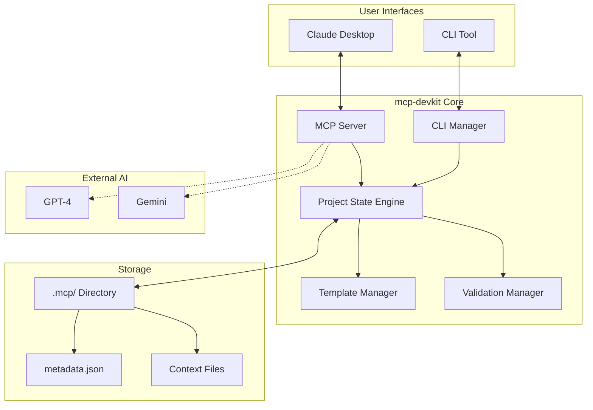

# mcp-devkit Architecture Guide

## 🏗️ System Overview

mcp-devkit is designed as a dual-interface system that enhances Claude's development workflow through persistent project memory and anti-drift mechanisms.



## 🎯 Core Components

### 1. MCP Server (`src/mcp/`)
The primary interface for Claude Desktop integration.

**Responsibilities:**
- Expose tools to Claude via Model Context Protocol
- Manage project state persistence
- Orchestrate multi-agent workflows
- Provide drift detection and guidance

**Key Files:**
- `server.ts` - Main MCP server implementation
- `tools/` - Individual tool implementations
- `resources/` - MCP resource providers

### 2. CLI Manager (`src/cli/`)
Secondary interface for direct project management.

**Responsibilities:**
- Command-line interface for project initialization
- Template management and validation
- Local development workflow support

**Key Files:**
- `index.ts` - CLI entry point
- `commands/` - Command implementations

### 3. Project State Engine (`src/core/`)
Manages persistent project memory and state.

**Responsibilities:**
- Track project phases and progress
- Maintain architectural decisions
- Store task history and context
- Calculate project analytics

**Key Components:**
- Template management
- State persistence
- Progress tracking
- Analytics generation

### 4. Template System
Provides structured project initialization.

**Template Structure:**
```
.mcp/
├── context_prd.md          # Product requirements
├── context_architecture.md # Technical architecture
├── context_tasklist.md     # Development tasks
├── metadata.json           # Project metadata
└── archive/                # Historical artifacts
```

## 🔧 Technical Architecture

### Technology Stack
- **Language**: TypeScript with strict mode
- **Runtime**: Node.js 18+
- **CLI Framework**: Commander.js
- **MCP SDK**: @modelcontextprotocol/sdk
- **Testing**: Vitest with V8 coverage
- **Validation**: AJV for JSON schemas

### Design Principles

#### 1. Separation of Concerns
- MCP server handles Claude integration
- CLI provides direct user interface
- Core engine manages business logic
- Clear boundaries between components

#### 2. Extensibility
- Pluggable agent architecture
- Template system for customization
- Hook-based extension points
- Configuration-driven behavior

#### 3. Persistence First
- All project state persisted to filesystem
- Crash-resistant design
- Version control friendly formats
- Human-readable storage

#### 4. Type Safety
- TypeScript strict mode throughout
- Comprehensive type definitions
- Runtime validation for external data
- Type-safe tool interfaces

## 🔄 Data Flow

### 1. Project Initialization
```
User → CLI/MCP Tool → Template Manager → File System → Project State
```

### 2. Status Checking
```
Claude → MCP Tool → Project State → File System → Response
```

### 3. Drift Detection
```
Claude → MCP Tool → Drift Analyzer → Project State → Recommendation
```

### 4. Multi-Agent Flow
```
Claude → MCP Tool → Agent Orchestrator → External AI → Summary → Claude
```

## 🛡️ Security Considerations

### Input Validation
- All user inputs validated before processing
- Path traversal prevention
- Command injection protection
- Schema validation for structured data

### File System Safety
- Restricted to project directories
- No system file modifications
- Safe path resolution
- Permission checking

### API Security
- No credentials stored in code
- Environment variable configuration
- Secure communication protocols
- Rate limiting considerations

## 📊 Performance Characteristics

### Scalability
- O(1) project state lookups
- Efficient file system operations
- Lazy loading of resources
- Minimal memory footprint

### Response Times
- Tool calls: <100ms typical
- Project analysis: <500ms for most projects
- Template creation: <1s including I/O
- Drift detection: <50ms

## 🔌 Extension Points

### Custom Tools
Developers can add new MCP tools by:
1. Creating tool implementation in `src/mcp/tools/`
2. Registering in server tool list
3. Adding appropriate tests
4. Updating documentation

### Template Extensions
New project templates can be added:
1. Create template files in `src/core/templates/`
2. Define template metadata
3. Add validation schemas
4. Test with real projects

### Agent Integrations
Additional AI agents can be integrated:
1. Implement agent interface
2. Add to orchestration system
3. Define communication protocol
4. Handle response parsing

## 🧪 Testing Strategy

### Unit Testing
- Individual component testing
- Mock external dependencies
- Edge case coverage
- Error scenario testing

### Integration Testing
- End-to-end workflows
- Real file system operations
- MCP protocol compliance
- CLI command testing

### Performance Testing
- Response time benchmarks
- Memory usage profiling
- Concurrent operation testing
- Large project handling

## 🚀 Deployment Architecture

### Local Installation
```
npm install -g mcp-devkit
↓
Global node_modules
↓
Symlink to bin
↓
Available as CLI command
```

### Claude Desktop Integration
```
Claude Desktop Config
↓
MCP Server Registry
↓
mcp-devkit serve
↓
Stdio communication
```

## 📈 Future Architecture Considerations

### Planned Enhancements
1. **Cloud Sync**: Optional project state synchronization
2. **Team Features**: Multi-user project coordination
3. **Plugin System**: Dynamic tool loading
4. **Web Dashboard**: Browser-based project overview

### Scalability Plans
1. **Caching Layer**: Reduce file system operations
2. **Async Operations**: Non-blocking tool execution
3. **Batch Processing**: Multiple tool calls optimization
4. **State Compression**: Efficient storage for large projects

## 🔍 Monitoring & Observability

### Logging
- Structured logging with levels
- Contextual information preservation  
- Error tracking and reporting
- Performance metrics collection

### Analytics
- Tool usage statistics
- Project success metrics
- Performance benchmarks
- Error rate monitoring

---

This architecture is designed to be simple, extensible, and focused on enhancing Claude's development capabilities through persistent memory and intelligent guidance.